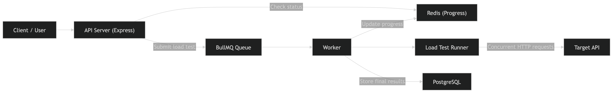

# Distributed Load Testing Platform

## About

This is a simple backend project for running load tests on any API.

The user sends a target URL, method, total requests, and concurrency. The API creates a job and returns a `testId` immediately. A worker picks up that job, sends concurrent requests to the target API, tracks progress in Redis, and stores the final result in PostgreSQL.

## Tech Stack

- Node.js
- Express
- Redis + BullMQ
- PostgreSQL

## How It Works

- `POST /load-test` accepts the request and pushes a job to BullMQ
- the worker processes the job and runs the load test
- Redis stores live progress using `progress:{testId}`
- PostgreSQL stores the final result after completion

## Architecture Diagram



## API

### `POST /load-test`

Starts a new load test.

Example body:

```json
{
  "url": "https://httpbin.org/get",
  "method": "GET",
  "total_requests": 10,
  "concurrency": 2
}
```

### `GET /load-test/:testId`

Returns the current status and final metrics when the test is completed.

## Run Locally

```bash
git clone https://github.com/ishivamgupta9/Distributed-Load-Testing-Platform.git
cd Traya
npm install
```

Create a `.env` file from `.env.example`.

Example:

```env
PORT=3000
REDIS_URL=redis://127.0.0.1:6379
DATABASE_URL=postgres://127.0.0.1:5433/load_testing
REQUEST_TIMEOUT_MS=10000
PROGRESS_UPDATE_BATCH_SIZE=10
PROGRESS_TTL_SECONDS=86400
QUEUE_NAME=load-tests
```

Make sure Redis and PostgreSQL are running, then start the worker and API:

```bash
npm run worker
npm start
```

## Project Structure

```text
src/
  config/
  lib/
  routes/
  services/
  workers/
  server.js
postman/
```

## Notes

- BullMQ is used so the API does not run the load test directly
- Redis is used for both queueing and live progress tracking
- PostgreSQL is used only for final result storage
- A Postman collection is included for testing
